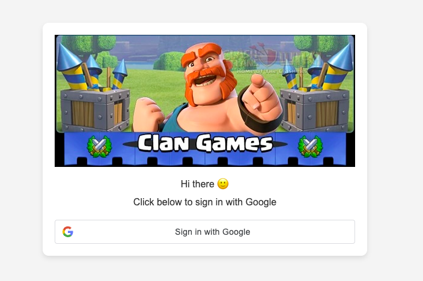

# Clan-Game-Database-Security-Project
## What is it?
This repository contains our semester project code, created by Caleb Griffy, Lingshan Jiang, and Isaac Hollis.

## Why is it useful?
This project is useful because it dives into database security principles.

## Who can use it?
Anyone who is interested in database security and is interested can expand what we are working on.

## How to use it?
1. Create a new project in MySQL Workbench.
2. Drag the Schema.sql file into the query menu.
3. Select all the text and click the lightning bolt that executes the selected portion of the script.


## How to Run the Django Project

1. Create mysql database and run scripts udner SQL, following script name prefix order
2. Create Google Oauth Authentication in GCP
3. Add `.env` file under core with following varibles values, enter credentail for mysql database, and google oauth client id

`core\.env`
```
GOOGLE_OAUTH_CLIENT_ID=
DATABASE_NAME = 
DATABASE_USER = 
DATABASE_PASSWORD = 
DATABASE_HOST = 
SALT_KEY = 
````


4. Start project 

```
python manage.py runserver 8000
```

5. Login Page at:

http://127.0.0.1:8000/user

